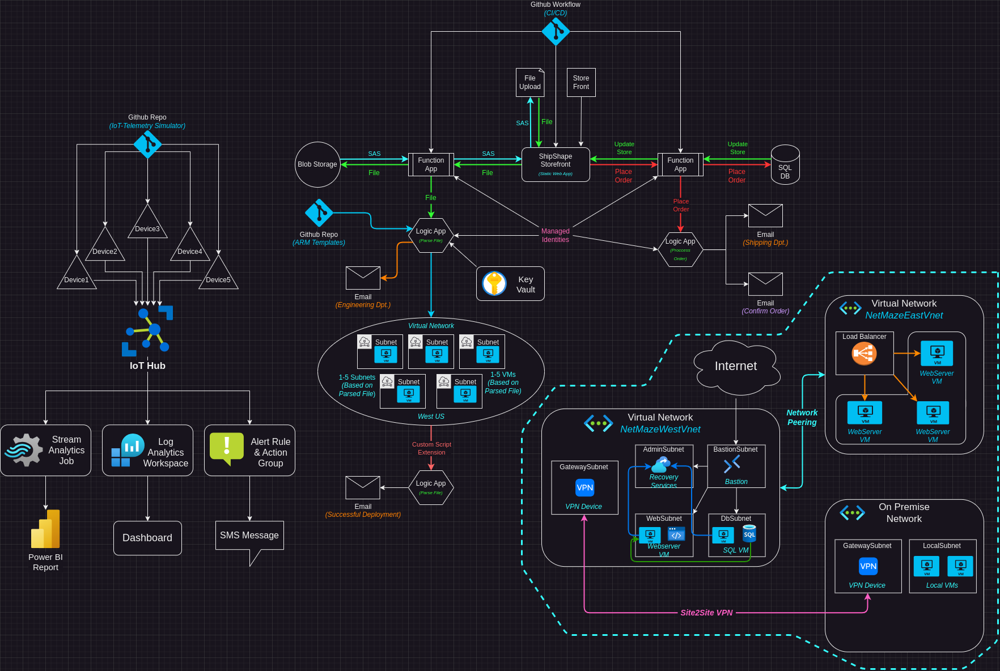

# Overview
***The full writeup can be found in the Writeup directory***

In this section of my Azure Administration project I want to showcase and detail the setup and deployment of various Azure networking services including Virtual Networks, Subnets, VMs, Azure Bastion, Recovery Services Vault, and Virtual Network Gateways. I want to get hands on experience with the skills learned and demonstrated in the [AZ-104 Azure Administration certification](https://learn.microsoft.com/en-us/credentials/certifications/azure-administrator/?practice-assessment-type=certification). This section will  focus on the "Implement and manage virtual networking" section of the exam. 
## Summary
In this section I deployed 2 virtual networks. Vnet1 contains a *WebSubnet*, *DbSubnet*, and *AdminSubnet*. The *WebSubnet* contains a VM running an Nginx webserver. The *DbSubnet* contains and SQL Server VM. The *AdminSubnet* contains a Recovery Services Vault. Vnet2 contains a Load Balancer as well as 3 simple webservers. The virtual networks are peered. The webserver in the 1st Vnet updates it's website with data from the SQL Server VM as well as the 3 VMs behind the Load balancer. 

Vnet1 also contains a Bastion subnet, which allows remote access into the network without having to assign any of the VMs with a public IP address.

Both virtual networks are peered, allowing communication between both networks, allowing all VMs in both networks to be backed up to the Recovery Services Vault in Vnet1, and allowing the Bastion in Vnet1 to provide access to Vnet2.

I deployed another Vnet meant to act as my "local network." I deployed a Virtual Network Gateway to LocalVnet and Vnet1. I then configured a Vnet-to-Vnet VPN to allow communication between the 2 networks. I configured the VPN to allow forwarded traffic into and out of Vnet2, that way I can access my cloud networks via a VPN connection from my "on-premise" datacenter.
### Technologies Used
- Azure Virtual Networks & Subnets
- Network Peering
- Virtual Network Gateway
- Vnet-to-Vnet VPN
- Azure Bastion
- Azure Load Balancer
- Recovery Services Vault
- Azure SQL Virtual Machines
- Azure Virtual Machines

### Topology
The topology of this section of the project:

