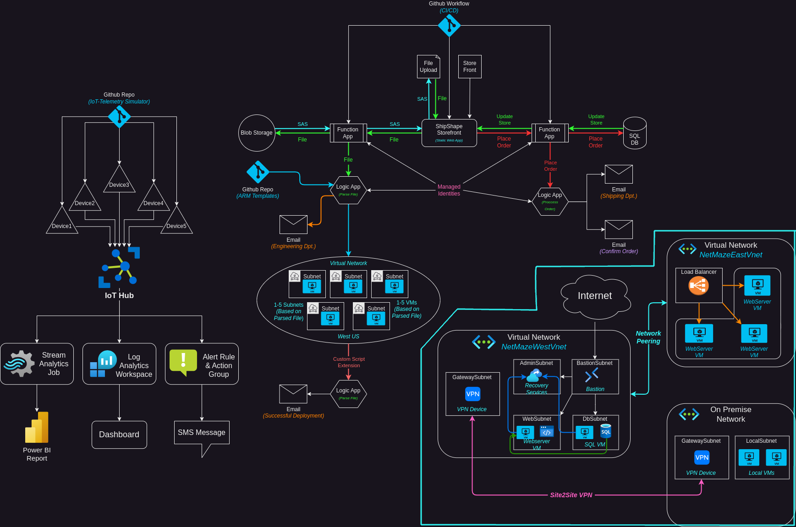

# Overview
In this section of my Azure Administration project I want to showcase and detail the setup and deployment of various Azure networking services including Virtual Networks, Subnets, VMs, Azure Bastion, Recovery Services Vault, and Virtual Network Gateways. I want to get hands on experience with the skills learned and demonstrated in the [AZ-104 Azure Administration certification](https://learn.microsoft.com/en-us/credentials/certifications/azure-administrator/?practice-assessment-type=certification). This section will  focus on the "Implement and manage virtual networking" section of the exam. In this project I will deploy 2 virtual networks. Vnet1 will host an SQL Server VM, a Webserver VM, a Recovery Services vault, and an Azure bastion, all in separate subnets. Vnet2 will contain 3 internal webserver VMs as well as a load balancer. The webserver VM in Vnet1 will pull data from the SQL VM, as well as data from the 3 webserver VMs in Vnet2. I will also configure an "on site" network connected to Vnet1 and 2 through a Site 2 Site VPN. This section of the project will focus on the "Implement and manage virtual networking" and "Deploy and manage Azure compute resources" objectives of the certification.
### Topology
The topology of this section of the project:

