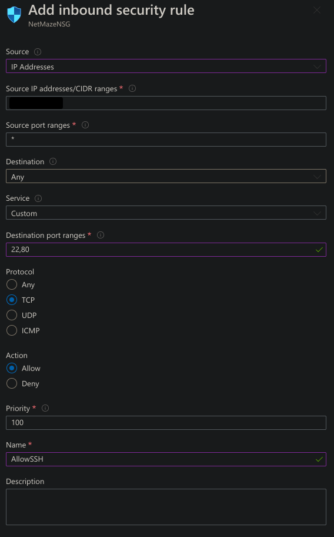
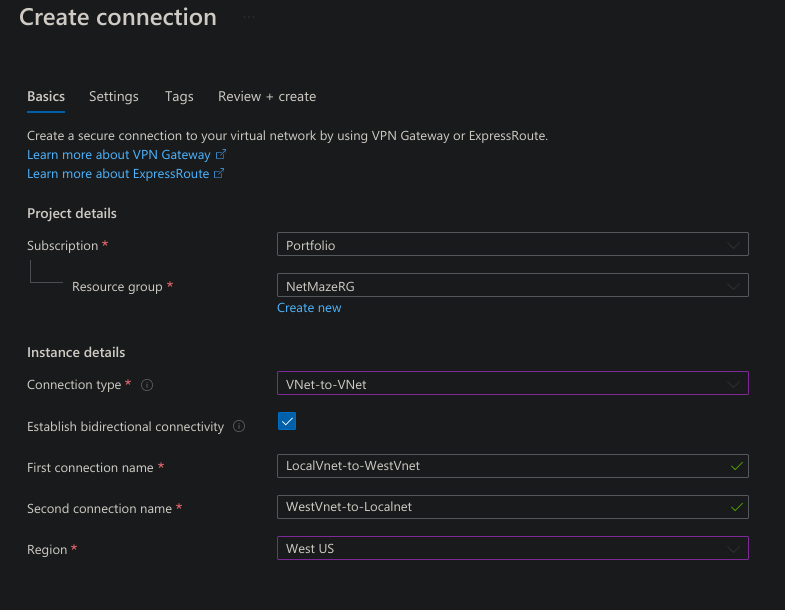

# Overview
In this section of my Azure Administration project I want to showcase and detail the setup and deployment of various Azure networking services including Virtual Networks, Subnets, VMs, Azure Bastion, Recovery Services Vault, and Virtual Network Gateways. I want to get hands on experience with the skills learned and demonstrated in the [AZ-104 Azure Administration certification](https://learn.microsoft.com/en-us/credentials/certifications/azure-administrator/?practice-assessment-type=certification). This section will  focus on the "Implement and manage virtual networking" section of the exam. In this project I will deploy 2 virtual networks. Vnet1 will host an SQL Server VM, a Webserver VM, a Recovery Services vault, and an Azure bastion, all in separate subnets. Vnet2 will contain 3 internal webserver VMs as well as a load balancer. The webserver VM in Vnet1 will pull data from the SQL VM, as well as data from the 3 webserver VMs in Vnet2. I will also configure an "on site" network connected to Vnet1 and 2 through a Site 2 Site VPN. This section of the project will focus on the "Implement and manage virtual networking" and "Deploy and manage Azure compute resources" objectives of the certification.
## Vnet1
I first create a new resource group called *NetMazeRG* and deploy a Vnet, NSG, and a web, database, and admin subnet.
```bash
# Create resource group
az group create --location westus --name NetMazeRG

# Create Vnet
az network vnet create --name NetMazeWestVnet -g NetMazeRG --location westus --address-prefix 10.10.0.0/16

# Create NSG
az network nsg create --name NetMazeNSG -g NetMazeRG --location westus

# Create 3 subnets
az network vnet subnet create --name WebSubnet --vnet-name NetMazeWestVnet -g NetMazeRG --address-prefix 10.10.1.0/24 --network-security-group NetMazeNSG && \
az netaz network vnet subnet create --name DbSubnet --vnet-name NetMazeWestVnet -g NetMazeRG --address-prefix 10.10.2.0/24 --network-security-group NetMazeNSG && \
az network vnet subnet create --name AdminSubnet --vnet-name NetMazeWestVnet -g NetMazeRG --address-prefix 10.10.3.0/24 --network-security-group NetMazeNSG
```
For the sake of time, I deploy only a very simple web server to the WebSubnet. I write an `index.html` file just containing a simple welcome message.
```html
<!DOCTYPE html>
<html>

<head>
  <!-- Basic -->
  <meta charset="utf-8" />
  <meta http-equiv="X-UA-Compatible" content="IE=edge" />
  <!-- Mobile Metas -->
  <meta name="viewport" content="width=device-width, initial-scale=1, shrink-to-fit=no" />
  <!-- Site Metas -->
  <meta name="keywords" content="" />
  <meta name="description" content="" />
  <meta name="author" content="" />

  <title>NetMaze</title>
</head>

<body>
<h1>This is a test site!</h1>
</body>
</html>
```


Now, this is definitely far from the most efficient way to host a simple static site in Azure. A much better way would be to use a Static Web App or even upload the file to blob storage and run a static site from there. However, I want to create a VM with something on it.
### Recovery Services Vault
Before creating any VMs I create a Recovery Services Vault. A Recovery Services Vault is used to back data, configuration info for things like VMs, workloads, servers, etc. I'll add this to the `AdminSubnet`. In the portal I go to *Recovery Services Vaults > Create*. I assign it a resource group and give it a name and region. On the *Redundancy* page I select *Locally-redundant*. *Geo-redundant* will be far more disaster resistant, but *Local* will keep costs lower.


On the *Networking* page I change the connectivity method to deny public access and I select the *Add* button to create a new private endpoint. I select my resource group and give it a name. For the *Target sub-resource* I select *AzureBackup*. *AzureBackup* is for backing up data like VMs and databases. *AzureSiteRecovery* is for backing up entire data centers in the case that an entire data center goes offline. I choose the correct Vnet and subnet. I make sure that the DNS section points to my *NetMazeRG* resource group. After I create the endpoint I select *Review + Create*.


Once the Vault is deployed I will go into the *Backup Policies* section and modify the *Enhanced Policy*. I turn all the retention times as low as they will go. This will save me costs. If this was for a serious, mission critical operation, this obviously wouldn't be a good idea. Here though, I just want to demonstrate the usage of a recovery service vault. After all, I need something to put in my AdminSubnet.


While the vault is deploying I create an ssh key pair and upload to Azure. Locally on the command line I run
```bash
# Create key
$ ssh-keygen                            
Generating public/private rsa key pair.
Enter file in which to save the key (/home/clayton/.ssh/id_rsa): /home/clayton/.ssh/NetMaze_key
Enter passphrase (empty for no passphrase): 
Enter same passphrase again: 
Your identification has been saved in /home/clayton/.ssh/NetMaze_key
Your public key has been saved in /home/clayton/.ssh/NetMaze_key.pub
The key fingerprint is:
SHA256:CYTJbcHr6hqOA3MRFSMGWLwQ1xbHZ7PLj96B+04agHI clayton@Nucleus
The keys randomart image is:
+---[RSA 3072]----+
|+==+=O+.         |
|ooo.*+= +        |
| . + ..+ o       |
|  o  .....       |
|  ..E...S.       |
|o .o  ..o.       |
|.o.  .  ooo      |
|.o ..   .*..     |
|..oo.  .+o+      |
+----[SHA256]-----+

# Copy PUBLIC key to clipboard
$ cat ~/.ssh/NetMaze_key.pub | xclip -sel clip
```
I then go to *SSH Keys > Create* in the portal. I select my resource group, name the key, and copy in my ***public*** key.


Once the Recovery Service Vault and SSH Key are deployed, I create my web server VM. I go to *Virtual Machines > Create*. To keep costs down I choose the smallest size, the good old *Standard_B1ls*, with 1 vCPU and half a gig of ram. I add it to my *NetMazeRG* resource group and give it a name, *WebServer*. I choose to use my existing `NetMaze_Key` ssh key. I also configure it to keep port 22 closed to the public.


On the *Disks* page I select a *Standard SSD*, again to keep costs down


On the *Networking* page I select the correct Vnet and subnet. I don't create a new NSG as there's already an NSG applied to the subnet. After this I'll add a rule to allow my public IP to SSH into the server


On the *Management* page I check the *Enable backup* box and select my Recovery Services vault and the *EnhancedPolicy*. The reason I can't use the standard policy here is that it doesn't support trusted launch VMs, which this is.


While the VM is deploying I hop over to my *NetMazeNSG* and add a rule to allow access from my local IP address to SSH on port 22 and HTTP on port 80. Why not just allow all connections from my IP, on all protocols? Well because currently I don't need it. And it's always better to enable the least amount of permissions possible to do what you need to do. If I need more access later, I'll enable it.



Once the VM is deployed I check that I'm able to SSH into it.
```bash
┌──(clayton㉿Nucleus)──[0:12:05]──[~/GitRepos]
└─$ ssh -i ~/.ssh/NetMaze_key azureuser@<REDACTED>

<...SNIP...>

azureuser@WebServer:~$ id
uid=1000(azureuser) gid=1000(azureuser) groups=1000(azureuser),4(adm),20(dialout),24(cdrom),25(floppy),27(sudo),29(audio),30(dip),44(video),46(plugdev),118(netdev),119(lxd)
```
Once on the vm I update the packages and install [Nginx](https://nginx.org/en/)
```bash
sudo apt update && sudo apt upgrade -y

sudo apt install nginx
```
Once Nginx is installed, I change the ownership over the directory `var/www` and its subdirectories to the `www-data` user. This is because running any type of web server as root is highly insecure, as if an attacker compromises the website they are instantly root on the whole webserver.
```bash
sudo chown -R www-data:www-data /var/www
```
I navigate to `/var/www/html` and remove the default `.html` file and replace it with my `index.html` that I wrote earlier. Because the directory is now owned by `www-data`, I use `sudo -u www-data` to write the file. Once created, I can send a `curl` request to localhost and see my `index.html` get returned.
```bash
azureuser@WebServer:/var/www/html$ sudo -u www-data vim index.html
azureuser@WebServer:/var/www/html$ curl localhost
<!DOCTYPE html>
<html>
<head>
  <!-- Basic -->
  <meta charset="utf-8" />
  <meta http-equiv="X-UA-Compatible" content="IE=edge" />
  <!-- Mobile Metas -->
  <meta name="viewport" content="width=device-width, initial-scale=1, shrink-to-fit=no" />
  <!-- Site Metas -->
  <meta name="keywords" content="" />
  <meta name="description" content="" />
  <meta name="author" content="" />
  <title>NetMaze</title>
</head>
<body>
<h1>This is a test site!</h1>
</body>
</html>
```
Once this is done, I can access the site from my local desktop and get the site.


Excellent, I now have my web server online.
## Database Subnet
Now to create my database, I'm going to use an SQL virtual machine. Once again, this is far from the best way to implement a small scale database, but this if for demonstration purposes. In the portal I search for *Azure SQL* and select an *SQL virtual machine* and select the Free SQL Server license on RHEL 8. On the *Basics* page I select my resource group, name the VM, and assign it a region. I check the box for the Azure Spot discount and select the *Standard_A2_v2* size. This gives me 2 vCPUs and 4 GB of ram which will be helpful in this case. Azure Spot discount lets you use VMs at a discounted rate by using Azure's excess compute capacity. The trade off is that if Azure needs that capacity, your VM will be deallocated. This is great for testing purposes.  I select my stored SSH key again and disallow public SSH access.


On the *Disks* page I select a *Standard HDD*, on the *Networking* page I select my *NetMazeVnetWest* Vnet and the *DbSubnet*. I don't create a new NSG as there's one applied to the subnet and I also check the box to delete the public IP and NIC when the VM is deleted. After this I select *Review + Create* and wait for it to deploy.

Now, if all of my networking settings are correct, I should be able to access this SQL server from my SSH session on the WebServer VM. I grab the private IP from the SQL VMs page and send a `ping`, and indeed I get a response!
```bash
/etc/nginx/sites-available$ ping 10.10.2.4
PING 10.10.2.4 (10.10.2.4) 56(84) bytes of data.
64 bytes from 10.10.2.4: icmp_seq=1 ttl=64 time=1.57 ms
```
After this I SSH into the SQL VM from my local machine and make sure all the packages are up to date
```bash
ssh -i ~/.ssh/NetMaze_key azureuser@<REDACTED>

<...SNIP...>

[azureuser@SQLServer ~]$ id
uid=1000(azureuser) gid=1000(azureuser) groups=1000(azureuser),4(adm),190(systemd-journal) context=unconfined_u:unconfined_r:unconfined_t:s0-s0:c0.c1023

[azureuser@SQLServer ~]$ sudo dnf update -y
```
### Setting Up SQL Database
Alright now that we're here I'll set up a simple SQL database. I'll then write a simple python script on the WebServer VM to query this SQL database and print selected values to the website, changing periodically.

To make interacting with the database easier, I add the `/opt/mssql-tools/bin` directory to my PATH by updating my `.bashrc`. I then log out and back in SSH for this to take effect.
```bash
echo 'export PATH="$PATH:/opt/mssql-tools/bin"' >> ~/.bashrc
```
Now I need to set a password for the SQL database admin. I do this my first stopping the SQL service, then using the `mssql-conf` command, and then restarting the server
```bash
sudo systemctl stop mssql-server

sudo /opt/mssql/bin/mssql-conf set-sa-password

sudo systemctl start mssql-server
```
I then use the `sqlcmd` command to interact with the database. Once there I create a database called `webserver` with one table, `fun_words`. The table has 2 columns, `id`, which will be a number, and `value` which will be a word.
```bash
# Connect to SQL Server
sqlcmd -S localhost -U SA -P '<PASSWORD>'
```
```sql
1> CREATE DATABASE webserver;
2> GO
1> USE webserver;
2> GO
Changed database context to 'webserver'.
1> CREATE TABLE fun_words (
2> id INT PRIMARY KEY,
3> value VARCHAR(255)
4> );
5> GO
1> SELECT * FROM fun_words; -- Make sure table and columns were created
2> GO
id          value                                                                 
----------- ---------------------------------------------------------------------------------------------------------------------------------------------------------------------------------------------------------------------------------------------------------------
(0 rows affected)
```
After this is successful I create a `.csv` file containing 20 pairs of numbers and words. The database runs as it's own user called `mssql`, so I need to create the file in a location that the `mssql` reader can access, otherwise the database will throw an error. I write the file to `/opt/mssql/data/fun_words.csv`
```csv
1,Auspicios
2,Agastopia
<...SNIP...>
18,Quadragenarian
19,Sabbulonarium
20,Ulotrichous
```
I then re-enter the SQL database and use the `BULK INSERT` command to add data from my `csv` file
```sql
1> USE webserver;
2> GO
Changed database context to 'webserver'.
1> BULK INSERT fun_words
2> FROM '/opt/mssql/data/fun_words.csv'
3> WITH
4> (
5> FIELDTERMINATOR = ',',
6> ROWTERMINATOR = '\n'
7> );
8> GO
(20 rows affected)
1> select * from fun_words; -- verify that data was added
2> go
id          value                                                                                  
1 Auspicios
2 Agastopia
3 Cabotage
<...SNIP...>  
```
Excellent. Now I need to add a user with read only privileges to the the database for the Webserver. I'll first create a login at the server level, and then configure a user for the specific database with the `db_datareader` role.
```sql
-- Create user
1> USE [master];
2> GO
Changed database context to 'master'.
1> CREATE LOGIN ReadOnlyUser WITH PASSWORD = '<PASSWORD>';
2> GO
1> USE [webserver];
2> GO
Changed database context to 'webserver'.
1> CREATE USER ReadOnlyUser FOR LOGIN ReadOnlyUser;
2> GO
1> USE [webserver];
2> GO
Changed database context to 'webserver'.
1> ALTER ROLE db_datareader ADD MEMBER ReadOnlyUser;
2> GO
1> DROP USER [ReadOnlyUser];
2> GO
1> USE [master];
2> GO
Changed database context to 'master'.
1> CREATE LOGIN Webserver WITH PASSWORD = '<PASSWORD>'
2> USE [webserver];
3> GO
Changed database context to 'webserver'.
1> CREATE USER Webserver FOR LOGIN Webserver;
2> GO
1> ALTER ROLE db_datareader ADD MEMBER Webserver;
2> GO
1> exit
```
```bash
# Log in with new user
[azureuser@SQLServer ~]$ sqlcmd -S localhost -U Webserver -P '<PASSWORD>'
```
```sql
-- Test to make sure user can only read data
1> USE webserver;
2> GO
Changed database context to 'webserver'.
1> SELECT * FROM fun_words;
2> go
id          value
1 Auspicious
<...SNIP...>
1> INSERT INTO fun_words (id, value) VALUES (999, 'test');
2> GO
Msg 229, Level 14, State 5, Server SQLServer, Line 1
The INSERT permission was denied on the object 'fun_words', database 'webserver', schema 'dbo'.
```
## Python Script to Read DB
Alright once this is successful I'll create a simple python script that will grab a word from the database every 30 seconds and update the `index.html` file. On my local machine I write this file:
```python
import os
import time
import random
from dotenv import load_dotenv
import pyodbc

load_dotenv()

conn_str = os.getenv('CONN_STR')
cnxn = pyodbc.connect(conn_str)
cursor = cnxn.cursor()

html_in = '/home/azureuser/sql/index.template.html'
html_out = '/var/www/html/index.html'

with open(html_in, 'r') as file:
    html_content = file.read()

while True:
    print("Connecting to database...")
    cursor.execute("SELECT TOP 1 value FROM fun_words ORDER BY NEWID()")
    row = cursor.fetchone()
    if row:
        fun_word = row[0]
        print(fun_word)
        updated_html = html_content.replace('[FUN_WORD]', fun_word)
        with open(html_out, 'w') as file:
            file.write(updated_html)
    print("Wrote file. Sleep for 30s")
    time.sleep(30)
cnxn.close()
```
This script will pull the db connection string from a `.env` file. It connects to the SQL database and pulls a word from the database. After that it opens `index.template.html` and updates the value `[FUN_WORD]` to the word from the database. Then it writes `index.template.html` to `/var/www/html/index.html`. After that it sleeps for 30 seconds and repeats.

I make a copy of `index.html` and rename it `index.template.html`. Below the `h1` tag I add an `h2` tag and enter `[FUN_WORD]`
```html
<body>
<h1>This is a test site!</h1>
<h2>[FUN_WORD]</h2>
</body>
```

I also create a `requirements.txt` file:
```
pyodbc
python-dotenv
```

as well as `.env` file containing my connection string:
```python
CONN_STR='DRIVER={ODBC Driver 18 for SQL Server};SERVER=<SERVER IP>;DATABASE=<DB NAME>;UID=<USERNAME>;PWD=<PASSWORD>;TrustServerCertificate=Yes'
```
I append `TrustServerCertificate=Yes` to the connection string to avoid the script throwing errors about not trusting the SQL Server's SQL certifcate. It would be possible to generate a cert for the SQL VM and add it the Webserver VM, but that's outside the scope of this project. This just bypasses the problem, but do note that it is a less secure way of doing things.

On the Webserver VM I create a directory called `sql` and a `.venv` folder inside there. I copy over my `sql.py`, `requiremnts.txt` and `.env` file from my local machine. I install the python `venv` module and create a virtual environment. I then install the requirements with `pip`.
```bash
azureuser@WebServer:~$ mkdir -p sql/.venv
azureuser@WebServer:~$ cd sql

# Install, create, and enter virtual environment
azureuser@WebServer:~/sql$ sudo apt install python3.8-venv
azureuser@WebServer:~/sql$ python3 -m venv .venv
azureuser@WebServer:~/sql$ source .venv/bin/activate

# Install required modules
(.venv) azureuser@WebServer:~/sql$ pip install -r requirements.txt
```
I need to [install the ODBC driver](https://learn.microsoft.com/en-us/sql/connect/odbc/download-odbc-driver-for-sql-server?view=sql-server-ver16) on the VM to enable me to connect to my SQL database. I also need to change a firewall rule on the SQL VM. Currently all connections that aren't explicitly allowed are block by the VM's firewall. I can see this with the `firewall-cmd` command. Only `cockpit`, `dhcpv6` and `ssh` are allowed. I create a new rule to allow access to port 1433, which is where MSSQL listens
```bash
# List default rules
[azureuser@SQLServer ~]$ sudo firewall-cmd --list-all
public (active)
  target: default
  icmp-block-inversion: no
  interfaces: eth0
  sources: 
  services: cockpit dhcpv6-client ssh

<...SNIP...>

# Allow port 1433
[azureuser@SQLServer ~]$ sudo firewall-cmd --zone=public --add-port 1433/tcp --permanent
success

# Reload firewall rules
[azureuser@SQLServer ~]$ sudo firewall-cmd --reload
success

# Verify this worked
[azureuser@SQLServer ~]$ sudo firewall-cmd --list-all
public (active)
  target: default
  icmp-block-inversion: no
  interfaces: eth0
  sources: 
  services: cockpit dhcpv6-client ssh
  ports: 1433/tcp

<...SNIP...>
```
One last thing I need to do before I run the script is give my user write permissions over `var/www/html/index.html`. Currently that file is owned by `www-data` and by running `ls -la` on it I can see that I only have read permissions. I could add myself to the `www-data` group, but that would allow my user to access anything that that entire group owns. I only need my user to be able to write to this specific file, and for that I'll use the `setfacl` command. I install the `acl` package and then give my user read and write permissions on that file. I can also check ACLs for specific files wit the `getfacl` command.
```bash
sudo apt install acl -y
sudo setfacl -m u:azureuser:rw /var/www/html/index.html
getfacl /var/www/html/index.html 
# file: var/www/html/index.html
# owner: www-data
# group: www-data
user::rw-
user:azureuser:rw-
```

Now that all this is done I can run my script. I open up a 2nd SSH session on the Webserver VM and go to `/var/www/html` and set a `watch` command that will watch the updated lines in `index.html`
```bash
watch -n 1 grep h2 index.html -C 2
```
 In the first session I run my script, and I can see that it successfully grabbed a word from the database. In my 2nd SSH session I see the `watch` update with the word. I continue to let it run and I see that the words continue to update.
 ```bash
# In 1st SSH session
(.venv) azureuser@WebServer:~/sql$ python3 sql.py 
Connecting to database...
Auspicious
Wrote file. Sleep for 30s

# In 2nd SSH session
Every 1.0s: grep h2 index.html -C 2

<body>
<h1>This is a test site!</h1>
<h2>Auspicious</h2>
</body>
</html>
```
I can also browse to the webserver's IP from my local machine and see the words on the page


## Backup & Restore w Recovery Services Vault
Alright, now that this is all running, I want to back up these VMs to my Recovery Services vault. For easy demonstration purposes I create a file in each home directory named after the current time and date:
```bash
touch "It's_2:09pm_on_May_2nd"
```
### Adding SQL VM to Vault
After this I head to my Recovery Services Vault in the Azure portal and go to the *Backup* section under *Getting started*. I select *Virtual Machine* for what I want to backup, and click *Backup*. I can't use *SQL Server on Azure VM* because unfortunately Linux VMs currently aren't supported for this option.


I select the *Standard* backup policy, click *Add* and select my *SQLServer* VM. After this I select *Backup*. And wait for the deployment to complete.


In the Recovery Vault going to *Backup items* under *Protected items*, I can see I have 2 VMs being backed up. Clicking on *Azure Virtual Machine*, I can see my VMs. The SQLServer has a warning next to is as the initial backup has not yet been performed.


I run a backup on both VMs by selecting them and clicking *Backup now*.


This takes around a half an hour to complete so while this is running I move on to setting up an Azure Bastion. Once both backups are complete, I hop back on my SSH sessions and change the file names to the current time
```bash
mv "It's_2:09pm_on_May_2nd" "It's_2:35pm_on_May_2nd"
```

Now before restoring the VMs I need to shut them down. I can do this with a `shutdown` command in the SSH session or I can select *Stop* in the *Overview* page on each VM.

Once both VMs are shut down, back in the *Recovery Services Vault* I select *Recover VM* and select my most recent restore point. I select the *Replace existing* configuration to overwrite my current VM. The *Create new* option can be used to essentially deploy a new VM from a restore point. After this I select *Restore* and do the same thing on the SQL VM.


While the restores are being run I can monitor them on the *Jobs* page


This takes awhile to complete, but once it does, I SSH back into the VMs and can see the the files were reverted to their previous state.
```bash
azureuser@WebServer:~ $ ls
"It's_2:09pm_on_May_2nd"
```
## Bastion
In the Admin Subnet, I want to set up Azure Bastion. Bastion is a service that provides SSH and RDP connection over TLS to all the VMs in the Vnet it's deployed to. You can SSH or RDP from the Azure portal or from a native SSH or RDP client. This allows you to access your private VMs without assigning them a public IP address.

In the Azure portal I go to *Bastions > Create* and create a new bastion. I select the *Developer sku*. This is a pretty paired down sku. It essentially just allows SSH access to Linux and RDP to Windows. The higher skus have a lot of useful features that you can check out [here](https://learn.microsoft.com/en-us/azure/bastion/bastion-overview#sku) For *Basic* and *Standard* skus, a subnet must exist in the Vnet named *AzureBastionSubnet* and it must have an address space of /27 or larger. In the *Developer* sku, this is abstracted away from you and handled behind the scenes. After this I select *Review + Create*.


Once deployed I test it out by going to my *Webserver* VM in the Portal. I select *Bastion*, provide the VM username and upload my private SSH key and hit *Connect*. This pops me into an SSH session in the browser on the VM. I can send a `ping` over to my SQL VM in the *DbSubnet* and I get a response.


It's also possible to use my native SSH client from the command line. For the `--target-resource-id` you need to grab the resource id for the VM. This can be obtained by selecting *JSON View* in the *Overview* page of the VM and copying the `id` field.
```bash
┌──(clayton㉿Nucleus)──[15:38:49]──[~]
└─$ az network bastion ssh --name <BastionHostName> --resource-group <ResourceGroupName> --target-resource-id <VMResourceId> --auth-type ssh-key --username <YourUsername> --ssh-key <PathToPrivateKey>

<...SNIP...>

azureuser@WebServer:~$ id
uid=1000(azureuser) gid=1000(azureuser) groups=1000(azureuser),4(adm),20(dialout),24(cdrom),25(floppy),27(sudo),29(audio),30(dip),44(video),46(plugdev),118(netdev),119(lxd)
```
# 2nd Vnet and Network Peering
Alright excellent. Now that I've got this whole Vnet going, I want to set up a second Vnet and then configure network peering between them so that devices in one Vnet can communicate with the other Vnet. To do this I'll create a new resource group, an NSG, a Vnet with 2 Subnets, and VM. I create everything but the VM from the command line. Since the topology of this new resource group will be similar to my current *NetMazeRG* resource group, I could theoretically export a template of that resource group and modify the values to create a deployment to this new resource group. But since this such a relatively small group, that would likely be more inefficient. I can deploy most of the resources with a long one-liner on the command line. My original Vnet has the address space 10.10.0.0/16, so for this Vnet I'll use an address space of 10.20.0.0/16. This is because once the networks are peered, they can't have any overlapping addresses.
```bash
# Create resource group
az group deploy --name NetMazeEastRG --location eastus

# Create vnet
az network vnet create --name NetMazeEastVnet -g NetMazeEastRG --location eastus --address-prefix 10.20.0.0/16 && \                                                       

# Create NSG
az network nsg create --name NetMazeEastNSG -g NetMazeEastRG --location eastus && \

# Create subnets
az network vnet subnet create --name WebSubnet --vnet-name NetMazeEastVnet -g NetMazeEastRG --address-prefix 10.20.1.0/24 --network-security-group NetMazeEastNSG && \
az network vnet subnet create --name DbSubnet --vnet-name NetMazeEastVnet -g NetMazeEastRG --address-prefix 10.20.2.0/24 --network-security-group NetMazeEastNSG && \
az network vnet subnet create --name AdminSubnet --vnet-name NetMazeEastVnet -g NetMazeEastRG --address-prefix 10.20.3.0/24 --network-security-group NetMazeEastNSG
```
Once this is done, I hop into the NSG and add an inbound rule to allow my Local IP address to SSH in. I'll eventually configure Bastion, and remove this rule. After configuring the rule I create a new VM in this vnet. I select my *NetMazeEastRG* resource group as well as the *East US* region. I select the trusty *Standard_B1ls* VM size, as well as an *Ubuntu Server* image. I also upload my public NetMaze SSH key.


For Disks, I select a *Standard HDD* as this VM can't take advantage of anything faster. For *Networking* I select my new *NetMazeEastVnet* and the *WebSubnet*. I don't create an NSG as I already have one applied. After this I selct *Review + Create* and wait for it to deploy.


Once deployed, I peer the 2 Vnets. I search for *Virtual Networks* in the search bar and select my *NetMazeWestVnet* virtual network. In the side panel i select *Peerings* under *Settings*, and then select *Add*


I configure a 2-way peer. Meaning that *NetMazeWestVnet* can access *NetMazeEastVnet*, and *NetMazeEastVnet* will be able to access *NetMazeWestVnet* as well.


I only select the first *Allow* option for each. This option allows traffic to flow from one Vnet to the other. 

The 2nd option, *Allow NetMazeEastVne* to receive forwarded traffic from *NetMazeWestVnet* Tis about handling traffic that originates from outside of *NetMazeEastVnet* but is routed through *NetMazeWestVnet* due to some form of transit relationship. By enabling this, you allow *NetMazeEastVnet* to accept traffic that didn't originate from within *NetMazeWestVnet*, such as traffic from an on-premises network routed via *NetMazeWestVnet*.

The 3rd option, *Allow gateway or route server in NetMazeEastVnet to forward traffic to NetMazeWestVnet is used when *NetMazeEastVnet*' has a virtual network gateway or route server that you want to function as a router, forwarding traffic into *NetMazeWestVnet*. This is typically needed in complex networking scenarios where *NetMazeEastVnet* serves as a hub in a hub-and-spoke network topology.

The 4th option *Enable NetMazeEastVnet* to use NetMazeWestVnet's remote gateway or route server* allows *NetMazeEastVnet* to utilize a gateway or route server located in *NetMazeWestVnet* for reaching networks outside of the peered VNets. This is often used when one VNet has connectivity (such as ExpressRoute or VPN to on-premises networks) that the other VNet needs to access without having its own dedicated gateway.
#### Troubleshooting SQLServer VM
Once the peering status is connected, I log into my *WebserverEast* VM and test out the peering. I'm able to send a ping to *Webserver*, but interestingly, I get no response from *SQLServer*. I'm able to ping *SQLServer* from *Webserver* so I know it's up and running. I try sending a ping to *WebserverEast* from *SQLServer* and I don't get a response there either. Now I know that there's no NSG rules blocking this, as I only have 2 nearly identical NSGs applying to each Subnet. And I know that I can access each Vnet from the other. Just to be sure, I check *IP Flow Verify* in the *Network Watcher* in the Azure Portal.

In the portal I go to *Network Watcher > IP Flow Verify*. I select *SQLServer* port 80 as the destination. I set the remote IP to my *WebserverEast* VMs IP. I get the result that access is allowed


This lets me know that it's likely a firewall rule on the *SQLServer* itself. I did have to manually open port 1433 earlier. This is strange though as I am able to send pings from *Webserver* to *SQLServer* without having to explicitly allow them. To test this out, I log into *SQLServer* through Bastion and edit the firewall rules to allow ICMP. I then start `tcpdump` to monitor traffic. I send a ping from *WebserverEast* and this time I get a response
```bash
# Set firewall rule
[azureuser@SQLServer]$ sudo firewall-cmd --zone=public --add-protocol=icmp --permanent
[azureuser@SQLServer]$ sudo firewall-cmd --reload

# On WebserverEast
azureuser@Webserver:~$ ping 10.10.2.4
PING 10.10.2.4 (10.10.2.4) 56(84) bytes of data.
64 bytes from 10.10.2.4: icmp_seq=1 ttl=64 time=68.8 ms

# Start tcpdump to listen for only ICMP
[azureuser@SQLServer ~]$ sudo tcpdump -i eth0 icmp
dropped privs to tcpdump
tcpdump: verbose output suppressed, use -v or -vv for full protocol decode
listening on eth0, link-type EN10MB (Ethernet), capture size 262144 bytes
08:11:37.048192 IP 10.20.1.4 > sqlserver.internal.cloudapp.net: ICMP echo request, id 19, seq 1, length 64
08:11:37.048306 IP sqlserver.internal.cloudapp.net > 10.20.1.4: ICMP echo reply, id 19, seq 1, length 64
```

After confirming that local firewall rules are the problem, I set rules to allow access to ICMP, HTTP on port 80, and MSSQL on port 1433 to my *NetMazeEastVnet*. After this I test the connections from my *WebserverEast* VM.
```bash
[azureuser@SQLServer shm]$ sudo firewall-cmd --zone=public --add-rich-rule='rule family="ipv4" source address="10.20.0.0/16" protocol value="icmp" accept' --permanent
success
[azureuser@SQLServer shm]$ sudo firewall-cmd --zone=public --add-rich-rule='rule family="ipv4" source address="10.20.0.0/16" port port=80 protocol=tcp accept' --permanent
success
[azureuser@SQLServer shm]$ sudo firewall-cmd --zone=public --add-rich-rule='rule family="ipv4" source address="10.20.0.0/16" port port=1433 protocol=tcp accept' --permanent
success
success
[azureuser@SQLServer shm]$ sudo firewall-cmd --reload
success

# Confirming rules added
[azureuser@SQLServer shm]$ sudo firewall-cmd --list-all
<...SNIP...> 
rule family="ipv4" source address="10.20.0.0/16" port port="1433" protocol="tcp" accept
rule family="ipv4" source address="10.20.0.0/16" protocol value="icmp" accept
rule family="ipv4" source address="10.20.0.0/16" port port="80" protocol="tcp" accept

# Start web server on port 80
[azureuser@SQLServer shm]$ sudo python3 -m http.server 80
Serving HTTP on 0.0.0.0 port 80 (http://0.0.0.0:80/) ...

# On WebserverEast
azureuser@Webserver:~$ ping -c 1 10.10.2.4
PING 10.10.2.4 (10.10.2.4) 56(84) bytes of data.
64 bytes from 10.10.2.4: icmp_seq=1 ttl=64 time=69.0 ms

azureuser@Webserver:~$ nc -zv 10.10.2.4 80
Connection to 10.10.2.4 80 port [tcp/http] succeeded!

azureuser@Webserver:~$ nc -zv 10.10.2.4 1433
Connection to 10.10.2.4 1433 port [tcp/ms-sql-s] succeeded!
```
Okay so I've got the connection working. Now to be honest I don't have a good explanation for why this step is required. Most firewalls are configured to deny everything that's not explicitly allowed. However, that doesn't explain why I was able to send pings from *Webserver* to *SQLServer* out of the box, but I had to explicitly allow it here. I check `iptables` and any other firewall zones that could exist, nothing. I tried disabling SELinux to see if that make a difference, no dice. My best guess is that there's some default rule that denies all requests from outside of the 10.10.0.0/16 address range that it resides in. However I can't find evidence of this anywhere. I'm fairly new to RHEL, I'm mainly on Debian or Ubuntu, so perhaps there's something really obvious here that I'm just not aware of at this point. Either way, I've got it working now.
## Load Balancer
So, what I want to do now is to create a 3 Webserver VMs in *NetMazeEastVnet* as well a load balancer. 

So the first thing I need to do is configure a NAT gateway. In the Azure portal I search for *NAT gateway* and select *Create*. On the *Basics* tab i select the resource group, name, and region. I also up the idle timeout from 4 to 15 minutes.


On the *Outbound IP* tab I create  a new IP and name it *nat-gw-public-ip*. On the *subnet* page I select *NetMazeEastVnet* and the *WebSubnet*. After this I select *Review + Create* and wait for it to deploy.


Once this is done I configure my load balancer. I go to *Load balancers > Create* in the portal. On he *Basics* page I select the resource group and create a name. I leave the rest of the settings at default.


On the *Frontend IP configuraton* page I add a new frontend IP config. I give it a name and add it to the *WebSubnet* in *NetMazeEastVnet*.


On the *Add backend pool* page I give it a name, and select *IP addres* as the *Backend pool configuration*. I can see the one VM I have in this subnet. I'll add 2 more VMs to this later.


On the *Inbound Rules* page I select *Add a load balancing rule*. I select the *frotend-lb* IP address and the *lb-backend-pool*. I select port 80 for *Port* and *Backend port*. I create a new health probe to check on TCP port 80 every 5 minutes. I leave session persistence at *None*, up the idle timeout to 15, and check the box for *Enable TCP reset*. Session persistence means that if a client sends a request and gets load balanced to VM1 and starts a session there, then all subsequent requests from that client will be sent to VM1. This is useful in scenarios where users have cookies or login sessions and directory them to another backend server would disrupt that. After this I select *Review + Create* and let the load balancer deploy.


Once deployed I create 2 new virtual machines. For both I create small *Standard_B1ls* size VMs running Ubuntu Server in my *NetMazeEastRG* resource group. On the *Networking* page I select *Azure load balancer* under the *Load balancing* options. I select the load balancer and backend pool I just created. I also select *None* under public IP, as this VM won't need it. After this I select *Review + Create* 


I now have 3 VMs in this virtual network all in the backend pool of my load balancer. I hop onto each one and create simple HTTP servers. I hop onto my *WebserverEast* VM and update the packages and install Nginx. I then change the ownership of the `/var/www` directory to the `www-data` user and create a very simple `index.html` page.
```bash
sudo apt update && sudo apt upgrade -y && sudo apt install nginx -y
sudo chown -R www-data:www-data /var/www
sudo -u www-data vim /var/www/index.html
# Remove Nginx default
sudo -u www-data rm index.nginx-debian.html
```
```html
<!-- index.html -->
<!DOCTYPE html>
<html>
<head>
	<title>WebServerEast1</title>
</head>
<body>
	<h1>Welcome to WebServerEast1!</h1>
</body>
</html>
```

Once this is done I hop over to *WebserverEast2*. Now since the other 2 VMs don't have public IP addresses, I can't SSH into the from my local computer. I can however use *WebserverEast* as a sort of "jump server". I can SSH in to the other 2 VMs from this one. I could also use the Bastion I have deployed in *NetMazeWestVnet*, but I would have to upgrade it from the Developer SKU to the Basic SKU, as Developer can't actually access peered networks. This would up the cost, and since Bastion charges by the hour weather it's being used or not, I'd rather not do this. So I SSH into *WebserverEast2* and repeat this process and then do the same on *WebserverEast3*.

Once this is set up, I can send requests to the Load Balancer's IP, and it will automatically forward that request to one of the VMs in its backend pool. To test that this is working I grab the Load Balancer's IP by going to *Load Balancers > LoadBalancerEast > Frontend IP configuration*. I then SSH into my *Webserver* VM in *NetMazeWestVnet* and send some `curl` requests to the load balancer. And indeed after a few responses I get different backend VMs!
```bash
azureuser@WebServer:/var/www/html$ curl -s 10.20.1.5 | grep h1
	<h1>Welcome to WebServerEast1!</h1>

azureuser@WebServer:/var/www/html$ curl -s 10.20.1.5 | grep h1
	<h1>Welcome to WebServerEast2!</h1>

azureuser@WebServer:/var/www/html$ curl -s 10.20.1.5 | grep h1
	<h1>Welcome to WebServerEast3!</h1>
```

Now what I want to do is modify the python script i have running on *Webserver* in the *NetMazeWestVnet* to send a GET request to the Load Balancer, and pull out whichever Webserver responded and print it to the `index.html` page.

I pop back into my `~/sql` directory where my python script is and enter the virtual environment. I then add `requests` and `bs4` to my `requirements.text` and run `pip install -r requirements.txt`. I add a line to my `index.template.html` that will be replaced with the name of the webserver. After that I open the python script and make some modifications
```bash
# Enver virtual environment
azureuser@WebServer:~/sql$ source .venv/bin/activate
# Install requests and bs4
(.venv) azureuser@WebServer:~/sql$ pip install -r requirements.txt
```
```html
<h1>This is a test site!</h1>
<h2>[FUN_WORD]</h2>
<h2>[WEB_SERVER]</h2> <!-- Added this line to be replaced -->
```
```python
import os
import time
import random
from dotenv import load_dotenv
import pyodbc
import requests # Added import
from bs4 import BeautifulSoup # Added import

load_dotenv()

conn_str = os.getenv('CONN_STR')
cnxn = pyodbc.connect(conn_str)
cursor = cnxn.cursor()

html_in = '/home/azureuser/sql/index.template.html'
html_out = '/var/www/html/index.html'
load_balancer_ip = "http://10.20.1.5" # Added Load balancer IP

with open(html_in, 'r') as file:
    html_content = file.read()

while True:
    print("Connecting to database...")
    cursor.execute("SELECT TOP 1 value FROM fun_words ORDER BY NEWID()")
    row = cursor.fetchone()

	# Send GET request to load balancer
    print("Sending GET request to load balancer...")
    response = requests.get(load_balancer_ip)
    if response.ok:
	    # Pull webserver name
        soup = BeautifulSoup(response.text, 'html.parser')
        web_server_name = soup.h1.text if soup.h1 else "Unknown Server"
        print(f"Response from: {web_server_name}")
    else:
        web_server_name = "Failed to connect"
        print(f"Error: {response.status_code}")

    if row:
        fun_word = row[0]
        print(fun_word)
        # Updated html with word and webserver name
        updated_html = html_content.replace('[FUN_WORD]', fun_word).replace('[WEB_SERVER]', web_server_name)
        with open(html_out, 'w') as file:
            file.write(updated_html)
    print("Wrote file. Sleep for 5s")
    time.sleep(5)
cnxn.close()
```

Once this is done I start a `watch` in the `/var/www/html` directory to check that `index.html` is being updated correctly. I run the script and sure enough every 5 seconds or so I can see the second `h2` line getting updated wit the web server name! I can also visit the web server in my browser and see it there as well
```bash
# In SSH sesion 1
(.venv) azureuser@WebServer:~/sql$ python3 sql.py 
Connecting to database...
Sending GET request to load balancer...
Response from: Welcome to WebServerEast3!
Quadragenarian
Wrote file. Sleep for 5s
Connecting to database...
Sending GET request to load balancer...
Response from: Welcome to WebServerEast2!
Impignorate
Wrote file. Sleep for 5s
Connecting to database...
Sending GET request to load balancer...
Response from: Welcome to WebServerEast1!
Jaculiferous
Wrote file. Sleep for 5s

# In SSH session 2
azureuser@WebServer:/var/www/html$ watch -n 1 grep h2 index.html -C 2

Every 1.0s: grep h2 index.html -C 2
<body>
<h1>This is a test site!</h1>
<h2>Jaculiferous</h2>
<h2>Welcome to WebServerEast1!</h2>
</body>
</html>
```


This is great! I've got 2 virtual networks with a successful peering and load balancing configured between the 2 of them.
## Site 2 Site VPN
The last thing I want to set up is a Site 2 Site (S2S) VPN. This is usually used for connecting an on premise network to an Azure network. Since I don't exactly have a on-premise datacenter to work with, I'll just be creating a new virtual network in a separate region and connecting it with a Site 2 Site VPN to the *NetMazeWestVnet*. This isn't really a "Site 2 Site" connection, rather it's a "Vnet 2 Vnet" connection, but it has similar steps. To configure a S2S VPN, you configure a Virtual Network Gateway in your virtual network, and the configure a Local Network Gateway that points to the [VPN device](https://learn.microsoft.com/en-us/azure/vpn-gateway/vpn-gateway-about-vpn-devices) in your local network, and connect the 2 gateways. The way a Vnet 2 Vnet connection will work is by configuring a Virtual Network Gateway in both Vnets. These gateways essentially are the "VPN Device" for your virtual network. You then configure a connection between the 2 gateways.

The first thing I need to do is deploy a *GatewaySubnet* in my Vnet. I go to *Virtual Networks > NetMazeWestVnet > Subnets > Add Gateway Subnet*. Now this Subnet needs to be named *"GatewaySubnet*, so I leave the name alone. I'm happy with the default address space, and I leave the rest of the settings alone as well.


Once this is done I go to *Virtual Network Gateways > Create* to create a gateway. I give it a name and region, I select the *NetMazeWestVnet*. For the SKU I select Basic. I create a public IP address. I disable *active-active* mode. Active-active mode is a high-availability mode that essentially deploys 2 instances of the VPN gateway. The enhances redundancy and reliability. After this I slect *Review + Create*. 


While this is deploying, I create a my "Local site" network. For this I create a new resource group, NSG, Vnet, and Subnet
```bash
# Create resource group
az group create --location westus2 --name LocalSiteRG

# Create vnet
az network vnet create --name LocalVnet -g LocalSiteRG --location westus2 --address-prefix 10.30.0.0/16 && \

# Create NSG
cmdand> az network nsg create --name LocalSiteNSG -g LocalSiteRG --location westus2 && \

# Create subnet
cmdand cmdand> az network vnet subnet create --name Subnet1 --vnet-name LocalVnet -g LocalSiteRG --address-prefix 10.30.1.0/24 --network-security-group LocalSiteNSG
```

Once deployed, I create another Virtual Network gateway in the Azure Portal. I use basically the same settings as before but just select my new Vnet and Resource Group. Once configured, I select *Review + Create*. Now, Virtual Network Gateways can take up to 45 minutes to deploy, so I go and make lunch while I wait.


Once deployed, I go into my *WestVnetGW* gateway and go to the *Connection* page and select *Add*. I specify the *Vnet-to-Vnet* connection type, check the box for bidirectionality. I give names to the connections, and select the region.



On the *Settings* page I select my *WestVnetGW* for the 1st gateway, and *LocalVnetGW* for the 2nd. After this I select *Review + Create*.


Once this is finished, I create a small VM inside my *LocalVnet*. Once it deploys I log in via SSH. I send a ping request over the *Webserver* VM in the *NetMazeWestVnet* and I get a response. I send a curl request to the HTTP site and I get that back as well. I also log in to the *Webserver* VM in the West subnet and make sure I can connect to the *LocalVnet*.
```bash
# From LocalVM
azureuser@LocalVM:~$ ping 10.10.1.4
PING 10.10.1.4 (10.10.1.4) 56(84) bytes of data.
64 bytes from 10.10.1.4: icmp_seq=1 ttl=64 time=23.4 ms

azureuser@LocalVM:~$ ping 10.20.1.4
PING 10.10.1.4 (10.10.1.4) 56(84) bytes of data.
64 bytes from 10.10.1.4: icmp_seq=1 ttl=64 time=23.4 ms

azureuser@LocalVM:~$ curl 10.10.1.4
<...SNIP...>
<body>
<h1>This is a test site!</h1>
<h2>Jaculiferous</h2>
<h2>Welcome to WebServerEast1!</h2>

# From WebserverVM
azureuser@WebServer:~$ ping 10.30.1.4
PING 10.30.1.4 (10.30.1.4) 56(84) bytes of data.
64 bytes from 10.30.1.4: icmp_seq=1 ttl=64 time=23.9 ms
```

Now even though I'm connected to the *NetMazeWestVnet* and it's peered with the *NetMazeEastVnet*, I can't currently access the East Vnet. This is because when configuring the peering, I left the boxes to allow forwarded traffic, and allow each Vnet to use the other's gateways unchecked. I go into *NetMazeWestVnet > Peerings* and check the box to allow the gateway in the West Vnet to forward traffic to the East Vnet.


I then go to *NetMazeEastVnet > Peerings* and check the boxes to allow the east Vnet to recieve forwarded traffic from the West Vnet, and to allow the East Vnet to use the gateway in the West Vnet.


Once this done, I'm able to connect from *LocalVnet* to *NetMazeEastVnet*
```bash
# From LocalVM
azureuser@LocalVM:~$ ping 10.20.1.4
PING 10.20.1.4 (10.20.1.4) 56(84) bytes of data.
64 bytes from 10.20.1.4: icmp_seq=1 ttl=64 time=95.3 ms

azureuser@LocalVM:~$ curl 10.20.1.4
<!DOCTYPE html>
<html>
<head>
	<title>WebServerEast1</title>
</head>
<body>
	<h1>Welcome to WebServerEast1!</h1>
</body>
</html>
```

Excellent, I now have an "on site" network connected through a VPN to a my Azure virtual networks
# Conclusion
This project was a great way to get hands on experience with configuring virtual networking infrastructure. I got experience in creating and configuring virtual network peering, VPN creation, VM and Subnet level firewall rules, as well as Load balancing, Azure Bastion, and backup and restore with a Recovery Services Vault.  It's one thing to read about these things, it's another to actually do it. I find myself to a "hands-on" learner and so this was a great experience for me.

